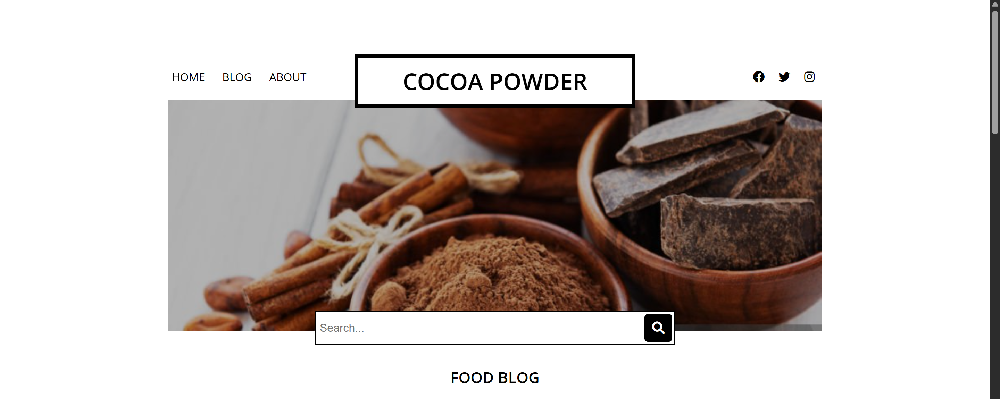

# Food Blog

A simple food blog showcasing Ghanaian recipes. The blog features different food articles with images and descriptions of popular Ghanaian dishes, including Koko & Koose, Waakye, Banku & Tilapia, Jollof Rice, and Ampesi.

 <!-- Updated to the actual screenshot path -->

## Features

- **Home Page**: Introduction to the food blog with a featured image and a search function.
- **Blog Section**: A list of food articles, each with images and summaries of the dishes.
- **Social Media Integration**: Links to the blog's social media profiles.
- **Subscription Form**: Option to subscribe to the blog's newsletter.
- **About Me**: Information about the creator of the blog.

## Technologies Used

- **HTML5**: Structuring the content.
- **CSS3**: Styling the webpage.
- **Font Awesome**: For social media icons.
- **Google Fonts**: For typography.

## How to Run

1. Clone this repository to your local machine:
   ```bash
   git clone https://github.com/SamuelNii32/Food-Blog.git
